# TomaBien

Aplicación de seguimiento de toma de medicamentos con sistema de notificaciones y conteo de stock de pastillas.

## Descripción

TomaBien es una aplicación para Android diseñada para ayudar a los usuarios a gestionar sus medicamentos de manera efectiva. Ofrece una interfaz simple e intuitiva para llevar un seguimiento de los horarios de medicación, configurar recordatorios y asegurarse de que los usuarios nunca se salten una dosis. Esta aplicación es ideal para personas que toman múltiples medicamentos o que necesitan un sistema confiable para mantenerse al día con su régimen de salud.

## Funcionalidades Clave

*   **Seguimiento de Medicación:** Agrega, edita y elimina medicamentos fácilmente.
*   **Alarmas Personalizables:** Configura recordatorios flexibles para cada medicamento, asegurando una toma a tiempo.
*   **Gestión de Dosis:** Especifica la información de dosis para cada medicamento.
*   **Gestión de Stock:** Conteo de pastillas para cada medicamento.
*   **Interfaz Intuitiva:** Diseño fácil de usar para una navegación y gestión sencilla.

## Capturas de Pantalla

**Mis Medicaciones**

    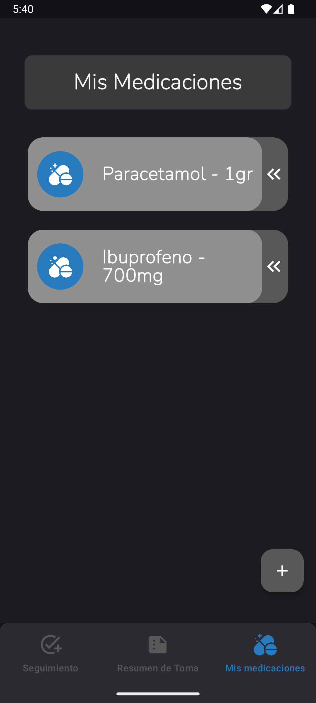
    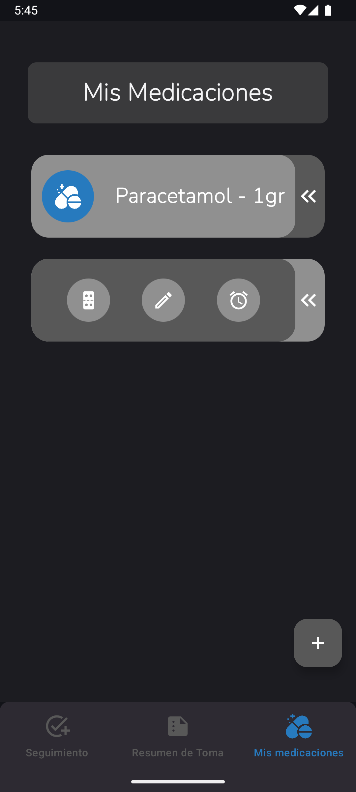

**Agregar/Editar Medicación**

    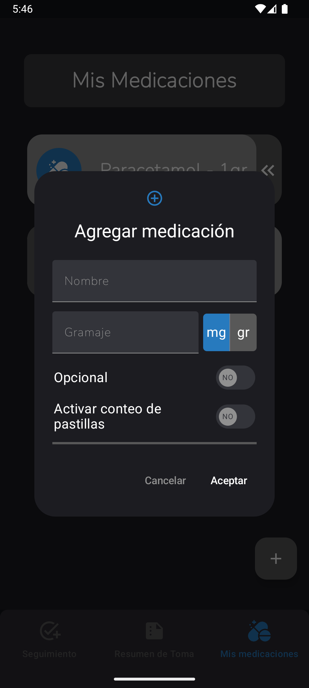
    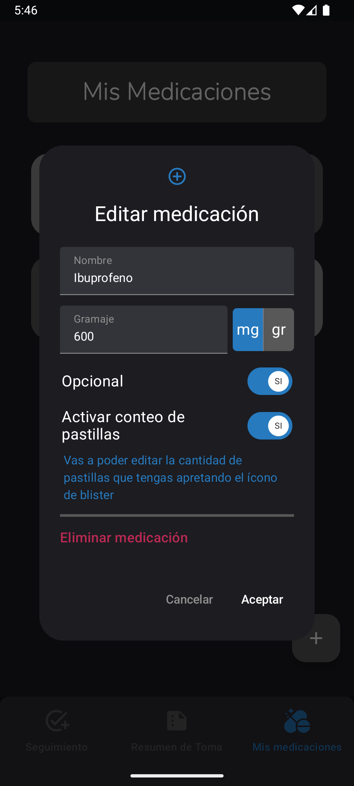

**Conteo de Pastillas**

    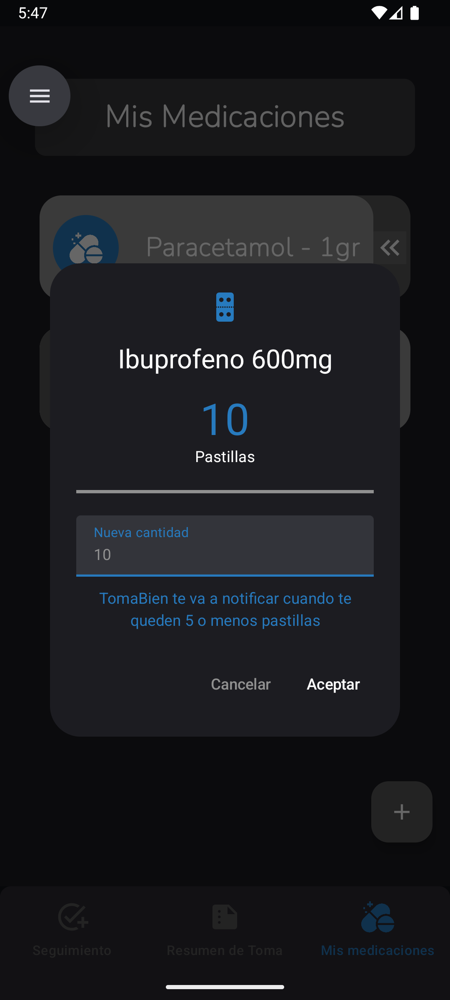

**Alarmas**

    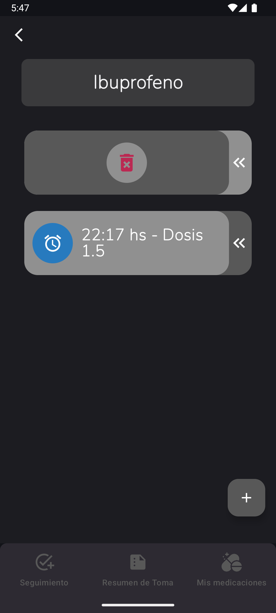
    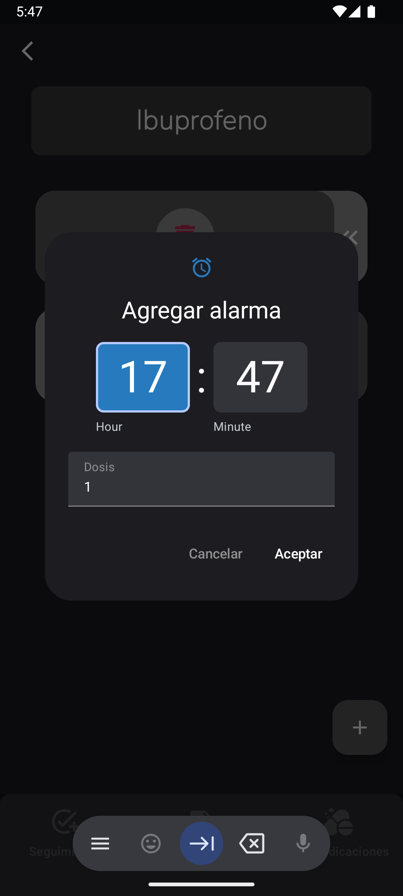 

**Seguimiento**

    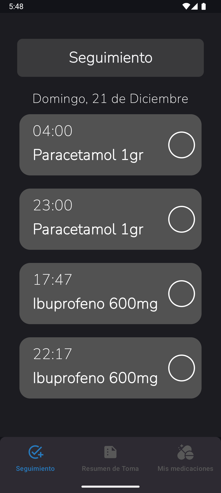
    

**Resumen de toma**

    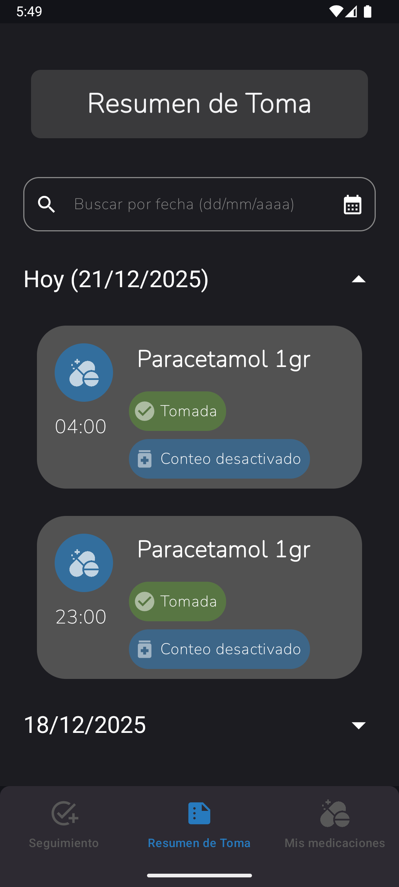
    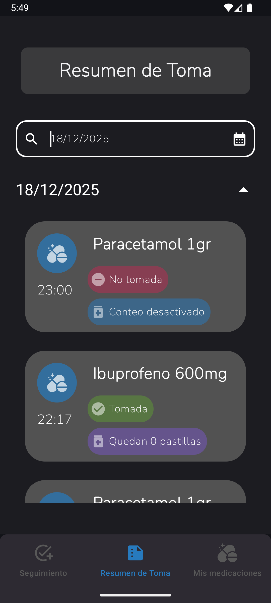

**Notificación**

    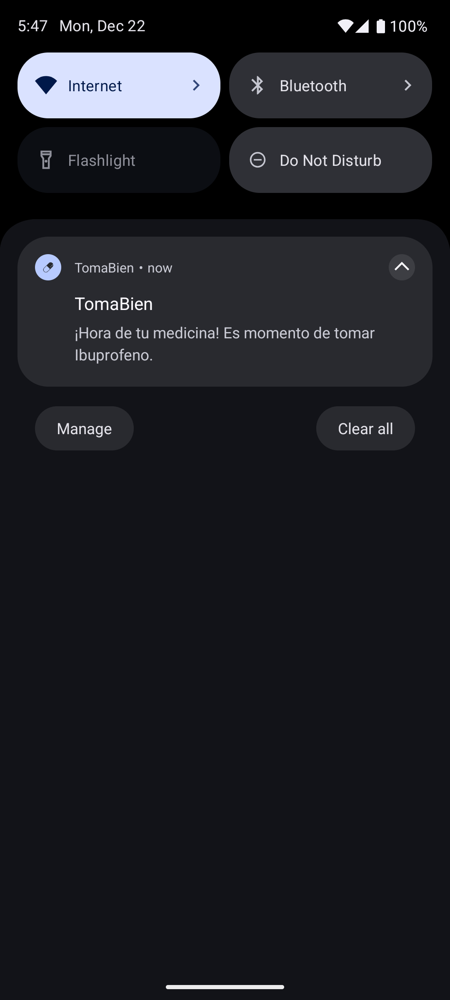

## Uso
1. **Agregar una medicación:**
    *   Navegar a la pantalla de 'Mis medicaciones'.
    *   Pulsar botón flotante con signo de suma.
    *   Ingresá las especificaciones del medicamento y si se quiere hacer un conteo de stock o no.
    *   En caso de conteo de stock se le llevara a otro formulario donde deberá agregar cuántas pastillas tiene en el momento.
2. **Gestión de alarmas:**
    *   Seleccionar el ícono de alarma del medicamento requerido clicando en el ícono de flecha.
    *   Agregar alarma pulsando el botón flotante de suma o eliminarla pulsando el ícono de basura según lo desee.
    *   Una alarma puede ser creada o eliminada pero no editada.
3. **Gestión de toma:**
    *   Navegar a la pantalla 'Seguimiento' donde se mostrarán las alarmas creadas anteriormente y el medicamento correspondiente a cada una de ellas.
    *   Tildar las casillas de los medicamentos ingeridos ese día.
4. **Resumen de toma:**
    *   Navegar a la pantalla 'Resumen de toma'.
    *   Se mostrarán, agrupados por fecha, los medicamentos que han sido tomados según lo tildado en la pantalla anterior.

### Tecnologías usadas

